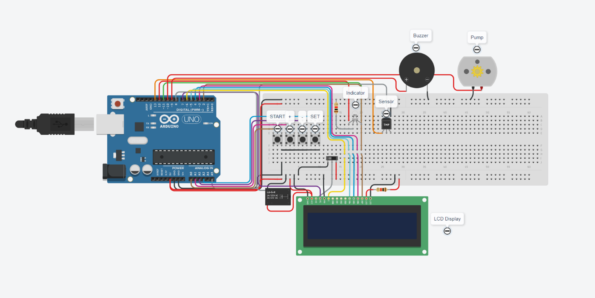

# 🌡️ Arduino Smart Thermal Regulation System

This project is a simple Arduino-based thermal regulation system built and tested in Tinkercad. It’s designed to monitor temperature in real time and automatically respond when things go beyond a set range.

---

## 🚀 What it does

Think of it like a basic smart thermostat. The system keeps reading the ambient temperature, shows it on a display (along with time), and turns something like a fan on or off depending on the conditions.

---

## 🛠️ Tech Stack

- **Platform:** Tinkercad (for simulation)  
- **Microcontroller:** Arduino Uno R3  
- **Language:** Arduino (C/C++)  

### Components used:
- TMP36 Temperature Sensor  
- 16x2 LCD Display (I2C / Parallel)  
- DC Motor (used as a fan)  
- RTC Module  
- Potentiometers and LEDs  

---

## 🧩 Features

- **Temperature Monitoring**  
  Reads analog data from the sensor and converts it into usable temperature values.

- **Live Display**  
  Shows both temperature and time on the LCD or serial monitor.

- **Automatic Control**  
  Turns the fan (or actuator) on/off based on preset limits.

- **Stable Switching (Hysteresis)**  
  Avoids rapid toggling by adding a small buffer between on/off thresholds.

- **Simulation Ready**  
  Fully tested in Tinkercad, so it’s easy to move to a real hardware setup later.

---

## 🖼️ Gallery

 Circuit Design (Tinkercad) 
| :---: | 
  

> **Live Simulation:** [View and Run on Tinkercad](https://www.tinkercad.com/things/jICS4unwTMm-thermo-clock-?sharecode=2dXkuUk0Ebovbbu9fkB9iWQa-_l2R4tBc6zC2da8r9Q)

---

## Notes

This project is mainly for learning and prototyping. It gives a good idea of how sensor-based automation systems work and can be extended further for real-world applications.

